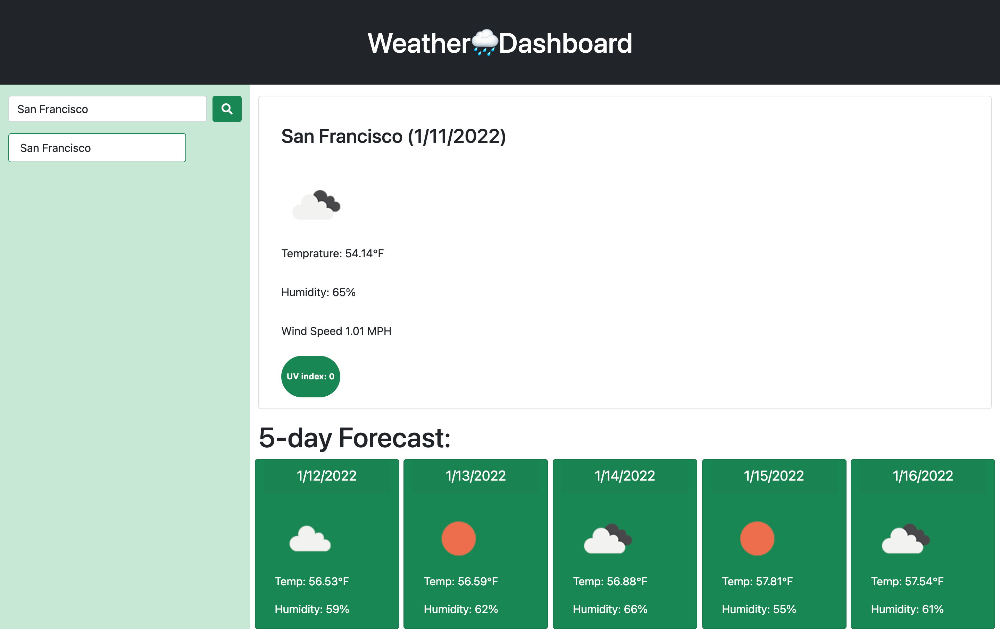

# Climate-forecast


---

## Table of Contents

* [Built with](#built-with)
* [APIs](#apis-used)
* [Live link](#deployed-link)
* [Site Layout](#layout)
* [Functionality](#functionality)
* [Learning points](#learning-points)

---
## Built With

* [HTML](https://developer.mozilla.org/en-US/docs/Web/HTML)
* [CSS](https://developer.mozilla.org/en-US/docs/Web/CSS)
* [Javascript](https://developer.mozilla.org/en-US/docs/Web/JavaScript)
---
## Apis Used

* [Open weather](https://openweathermap.org/api)
* [Moment.js](https://momentjs.com/)
* [jQuery](https://jquery.com/)
* [Bootstrap](https://getbootstrap.com/)

---
## Deployed Link

* [Weather Dashboard](#)



---

## Layout
In the first column there's two rows. The first row contains a search bar where user can input a city name. In the second row a list will display the user's search history. Moving to the second column User will find the current weather forecast and below that they'll find the the weather forecast for the next five days.

---

## Functionality

### Weather Display 

Upon users City name input search, the current weather forecast for today will be displayed. 


 > code to get and display current weather data

```javascript

$.ajax({
    url: url5day,
    method: "GET"
 })
    .then(function(data) {
     console.log(data);
    $("#mainIMG").attr("src","https://openweathermap.org/img/wn/"+ img + "@2x.png");
    $("#mainTemp").text("Temprature: " + data.main.temp + "°F")
    $("#mainHum").text("Humidity: " + data.main.humidity + "%")
    });
   
```

### User History

User will be able to view their search history underneath the search bar.


---


### Five day forecast

User can see the weather forecast for the next five days 


> This is is displaying the next five days for San Francisco !

---
### Color coded UV index

UV index levels are color coded. Red being Extreme; Green being moderate; Yellow being high.
For more information on UV index levels go [here!](https://www.epa.gov/sunsafety/uv-index-scale-0)


> 	levels between 0-5 are considered Moderate


> Levels between 6-9 are considered High


> Levels 10 or higher are condsidered dangerous 


---

### Learning points 

My journey with javascript has improved. I dreaded writing javascript and now I welcome it. Jquery being my favourite js library has contributed to my like for javascript. During the application I also learned how I can use server side APIs along with my code. Getting data from that server and displaying it to the website. As with everything improvements can happen. For starters, I am going to improve on my code layout. I can definitely write it more neater next time and use more shortcuts to shorten my code. 

---

## License
for UC Berkely Extention bootcamp program 

### Open weather: <br>
Supplier of Achilles UVDB community
© 2012 — 2021 OpenWeather ® All rights reserved

### jQuery: <br>
©  2022 OpenJS Foundation and jQuery contributors. All rights reserved.

### Moment: <br>
Moment.js is freely distributable under the terms of the MIT license.

### Bootstrap: <br>
Code licensed MIT, docs CC BY 3.0.
Currently v5.1.3.

---
#### Author and App developer -  Joshua Meza 
[GitHub](https://github.com/705h-S) <br>
[linkedin](https://www.linkedin.com/in/joshua-meza-918b77224/)